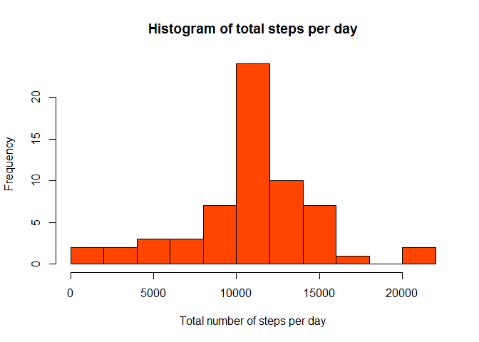

# Reproducible Research: Peer Assessment 1
Achilleas Katsaros  


## Loading and preprocessing the data

For the purpose of loading, it is enough to unzip the compressed input file and read the CSV.  
The resulting data frame is then preprocessed, so that the `date` column has a Date datatype.


```r
activity_data <- read.csv(unzip('activity.zip'))
activity_data$date <- as.Date(activity_data$date)
```

## What is mean total number of steps taken per day?

First, a `steps_per_day` data frame is created, with the help of the `dplyr` package.


```r
# group the data frame by date and sum the number of steps, removing NA's
by_date <- group_by(activity_data, date)
steps_per_day <- summarize(by_date, sum_steps = sum(steps, na.rm=TRUE))
```

This is the histogram of the total number of steps for each day.


```r
hist(steps_per_day$sum_steps, breaks = 10, main = 'Histogram of total steps per day', xlab = 'Total steps per day', col = 'green')
```

 


```r
# calculate the mean and median total number of steps per day
mean_val <- sprintf('%.2f', mean(steps_per_day$sum_steps))
median_val <- sprintf('%.2f', median(steps_per_day$sum_steps))
```

The **mean** and **median** total number of steps per day are **9354.23** and **10395.00** respectively.

## What is the average daily activity pattern?

A `steps_per_interval` data frame is created, with the help of the `dplyr` package.


```r
# group the data frame by interval and find the average number of steps, removing NA's
by_interval <- group_by(activity_data, interval)
steps_per_interval <- summarize(by_interval, avg_steps = mean(steps, na.rm=TRUE))
```

This is the time series plot of the 5-minute interval and the average number of steps taken.


```r
plot(steps_per_interval, type = 'l', main = 'Time series plot of average number of steps', xlab = '5-minute interval', ylab = 'Average number of steps', col = 'blue')
```

 


```r
# find the interval where the avg_steps column takes its maximum value
max_index <- which.max(steps_per_interval$avg_steps)
max_interval <- steps_per_interval$interval[max_index]
# calculate the time (hours and minutes) when this interval starts
hours <- floor(max_interval/100)
minutes <- max_interval%%100
```

The **5 minute interval** which contains the maximum number of steps - on average across all days in the dataset - is the one that starts at **8 hours** and **35 minutes**.

## Imputing missing values


```r
# calculate the total number of rows with NA's
na_rows <- sum(is.na(activity_data$steps))
```

The total number of missing values in the dataset is **2304**.

With the following code, the NA's are replaced by the average number of steps for the same interval.


```r
# find the rows where the number of steps is NA and
# replace each of them with the average for the same interval
for (i in 1:dim(activity_data)[1]) {
    if (is.na(activity_data$steps)[i]) {
        index <- activity_data$interval[i]
        activity_data$steps[i] <- steps_per_interval$avg_steps[steps_per_interval$interval == index]
    }
}
```


```r
# recalculate the total number of rows with NA's
na_rows <- sum(is.na(activity_data$steps))
```

The total number of missing values in the dataset is **0**.

Now that there are no NA's in the dataset, the `steps_per_day` data frame is recreated.


```r
# group the data frame by date and sum the number of steps
by_date <- group_by(activity_data, date)
steps_per_day <- summarize(by_date, sum_steps = sum(steps))
```

This is the new histogram of the total number of steps for each day.


```r
hist(steps_per_day$sum_steps, breaks = 10, main = 'Histogram of total steps per day', xlab = 'Total steps per day', col = 'orangered')
```

 


```r
# recalculate the mean and median total number of steps per day
mean_val <- sprintf('%.2f', mean(steps_per_day$sum_steps))
median_val <- sprintf('%.2f', median(steps_per_day$sum_steps))
```

After imputing the missing values, the **mean** and **median** total number of steps per day are **10766.19** and **10766.19** respectively.  
The impact of imputing the missing values is that now the mean and the median coincide.

## Are there differences in activity patterns between weekdays and weekends?

A new factor column called `day_type` is added to the data frame.  
Specifies whether the corresponding date is a `weekday` or a `weekend`.


```r
# add a new factor column 'day_type' for weekdays and weekends
activity_data <- mutate(activity_data, day_type = ifelse(as.POSIXlt(date)$wday %in% c(0, 6), 'weekend', 'weekday'))
```

The `steps_per_interval` data frame is recreated and now the grouping is done by interval and day type.


```r
# group the data frame by interval and day type and find the average number of steps
by_interval <- group_by(activity_data, interval, day_type)
steps_per_interval <- summarize(by_interval, avg_steps = mean(steps))
```
